<div align="center">

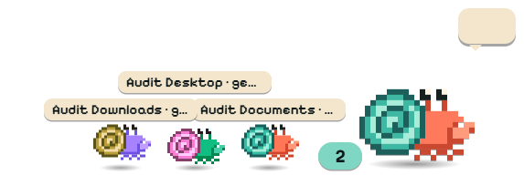

# Shellby

**A pixel hermit crab that lives on your Windows desktop and gets things done with Claude Code.**

Click him, type a task ("tidy my Downloads", "build yourself a tool that…"), and watch him scuttle.<br>
He sends out helper crabs, builds his own tools, and runs routines on a schedule, all on<br>
**your own Claude Pro/Max subscription**. No API keys, no per-token billing.

[Download](https://github.com/x-salmon/shellby/releases/latest) · [**Community packs**](https://x-salmon.github.io/shellby-packs/) · [How it works](#how-it-works) · [Skins](docs/SKINS.md) · [Security](SECURITY.md) · [Changelog](CHANGELOG.md)

</div>

---

<table>
<tr>
<td width="33%">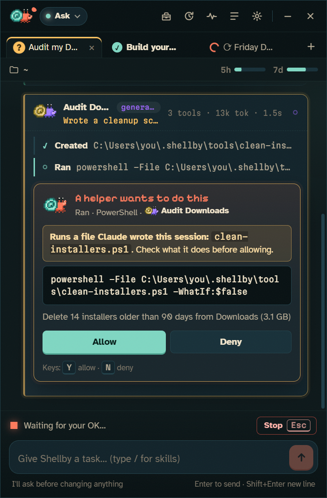</td>
<td width="33%">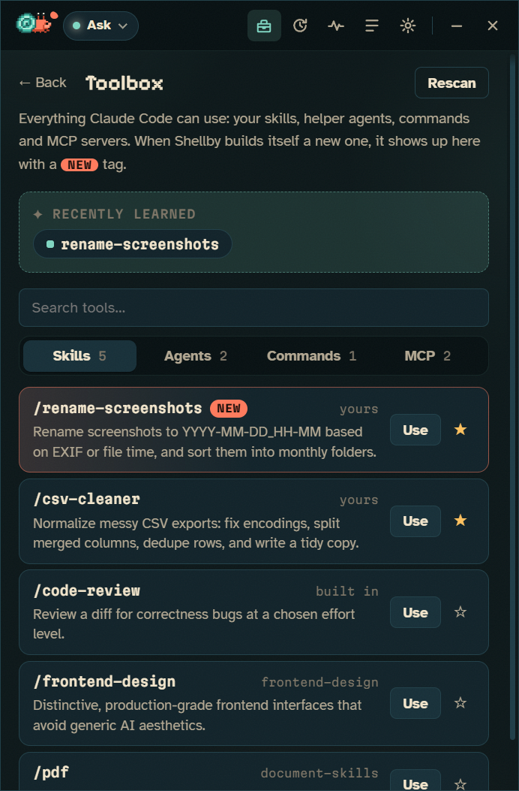</td>
<td width="33%">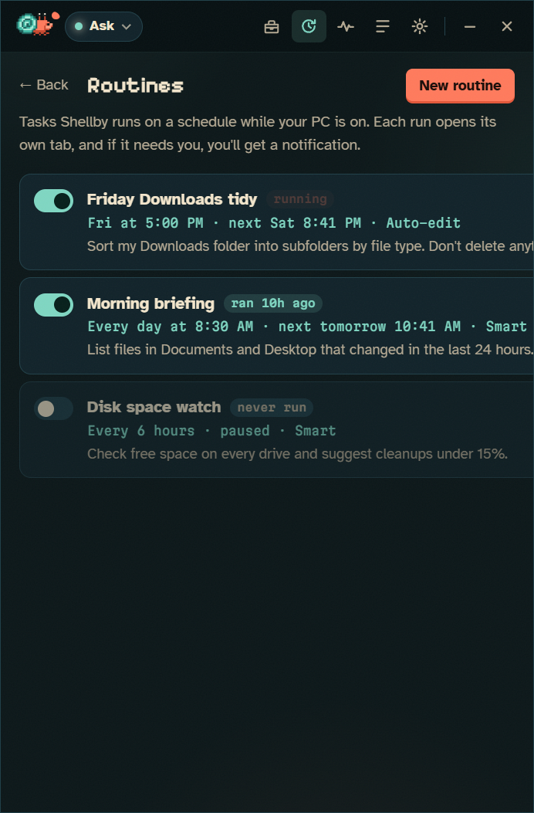</td>
</tr>
<tr>
<td align="center"><sub>Helpers work in parallel, each in its own lane</sub></td>
<td align="center"><sub>Skills and agents he builds show up in his Toolbox</sub></td>
<td align="center"><sub>Routines run on a schedule</sub></td>
</tr>
</table>

## What it does

### He works like you use Claude Code: orchestrating
- **Crew view.** When Claude delegates to subagents, each helper gets its own lane: task, live activity, tool count, tokens and time. The same number of helper crabs scuttle out next to Shellby on your desktop, and click one to jump to its conversation. When a helper needs permission, the card shows up in its lane, labelled with which crab is asking.
- **Parallel conversations.** Tabs, each with its own Claude Code process: build a tool in one while you use it in another. The desktop crab shows how many are running. Shortcuts: <kbd>Ctrl</kbd>+<kbd>T</kbd>, <kbd>Ctrl</kbd>+<kbd>W</kbd>, <kbd>Ctrl</kbd>+<kbd>Tab</kbd>.
- **Toolbox: he learns tricks.** Everything Claude Code can use: skills, subagents, slash commands and MCP servers (with connection status). When Claude writes itself a new skill or agent, Shellby notices the file, celebrates on your desktop, tags it **new**, and offers to pin it. Pinned tricks become one-click chips on the start screen, and <kbd>/</kbd> in the composer autocompletes all of them.
- **Routines.** Recurring tasks ("every Friday at 5, tidy Downloads") that run in their own tab with their own permission mode. Missed runs catch up when your PC wakes up.

### Dress him up: the Wardrobe
<p align="center">
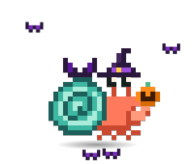  
</p>

- **36 pixel accessories and 7 effects** in six slots: hats, face, neck, held item (in his claw), shell, and effects like snowfall, orbiting bats, falling leaves, fireflies and confetti. Accessories animate with the part they're attached to, so a pumpkin swings with his claw and a hat bobs with his eye stalks.
- **Unlock them by using Shellby.** 21 trophies, a few of them secret: finish 10 tasks for a hard hat, send out your first helper for a captain's hat, let him run a script he built himself for a wrench, finish a task after midnight for a nightcap, free up a full drive for a broom. Unlocks celebrate on your desktop with confetti. If you don't want to grind, "Unlock everything" is one switch away.
- **Seasons.** He dresses up for Halloween, winter, Valentine's, spring, summer and autumn automatically, and gives the season back if you change his look. Seasonal items are collectibles: be around while the season is on, and they're yours to keep.
- **Helper crabs wear matching hats**, and every crab in the app is dressed the same way.
- **Community packs.** More hats, effects and colors from other people, installed in one click. See [Community wardrobe](#community-wardrobe) below.

<table>
<tr>
<td width="50%">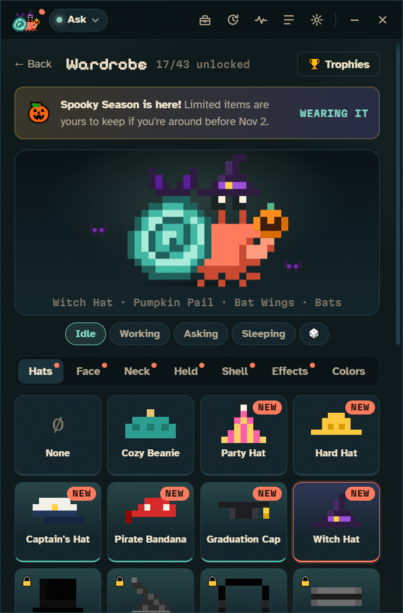</td>
<td width="50%">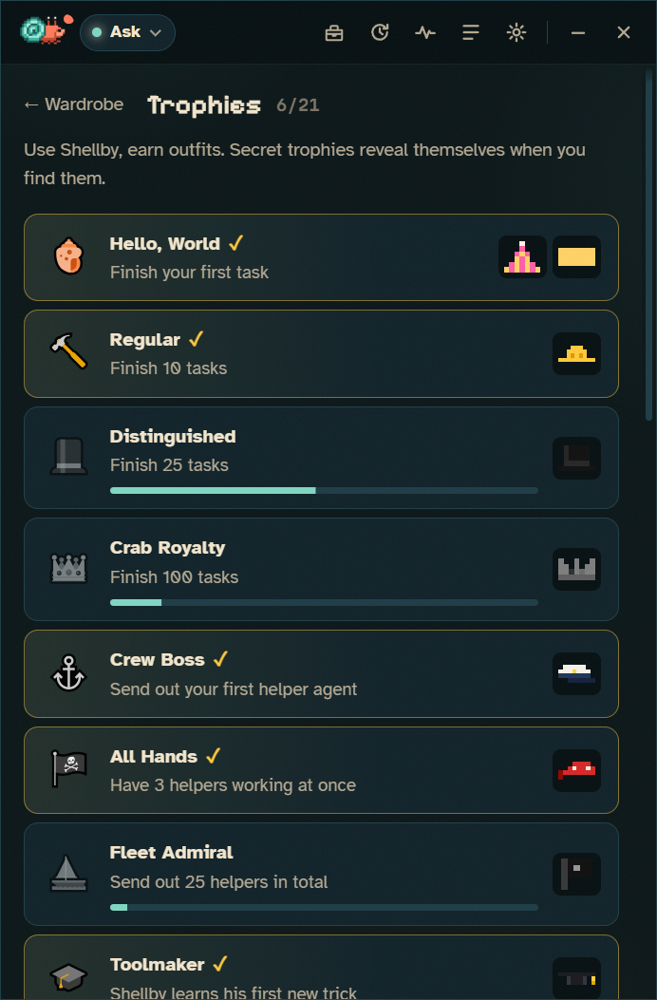</td>
</tr>
</table>

### Community wardrobe

<a href="https://x-salmon.github.io/shellby-packs/"></a>

**[x-salmon.github.io/shellby-packs](https://x-salmon.github.io/shellby-packs/)** is a gallery of wardrobe packs made by the community.

- **Browse and install.** Every item is previewed on a live, animated Shellby. Click **Add to Shellby** and the app opens, shows you exactly what the pack contains, and asks before anything installs.
- **Safe by design.** Packs are pixel art and settings in JSON, so they can't run code. Each download is checked against the gallery's SHA-256 before Shellby looks at it.
- **Make your own.** Draw items pixel by pixel in [Pack Studio](https://x-salmon.github.io/shellby-packs/studio.html), try them on the crab, and export a pack. Shellby's own wardrobe is written in that same format ([docs/ADDONS.md](docs/ADDONS.md), [JSON Schema](docs/addon.schema.json)).
- **Share it.** Open a pull request on [x-salmon/shellby-packs](https://github.com/x-salmon/shellby-packs). An automated check validates it, and once it's merged it appears in the gallery and in everyone's Shellby.

### He keeps an eye on your PC: Health
<p align="center">
  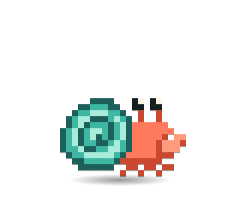
</p>

- **Live vitals.** GPU and CPU temperatures, CPU and GPU load, memory and every drive's free space, each with a 10-minute sparkline. It's all read locally, with no admin rights needed.
- **His mood follows your hardware.** When the GPU runs past 80°C he sweats and fans himself with his claw. Past 88°C he pants under a heat shimmer, and it wakes him up if he's asleep. Nearly-full memory makes him dizzy, with stars circling his eyes, and a full drive leaves junk spilling out of his shell. Readings must stay over the line for about 20 seconds, so a loading screen spike doesn't count.
- **Notifies you when something's off**, once per problem rather than every 5 seconds, and tells you when it's fixed.
- **"Ask Shellby why."** One click starts a read-only Claude Code task that finds out what's heating the GPU, eating the memory, or filling the drive, and reports back without deleting or killing anything.
- **Your thresholds.** Set when the GPU, CPU, memory and drives count as trouble, or turn the desktop reactions off and keep only the dashboard.
- **CPU temperature** comes from [LibreHardwareMonitor](https://github.com/LibreHardwareMonitor/LibreHardwareMonitor)'s local web server, because Windows won't give it to normal apps. The Health view walks you through the setup. NVIDIA GPUs work out of the box through `nvidia-smi`. More in [docs/HEALTH.md](docs/HEALTH.md).

<p align="center">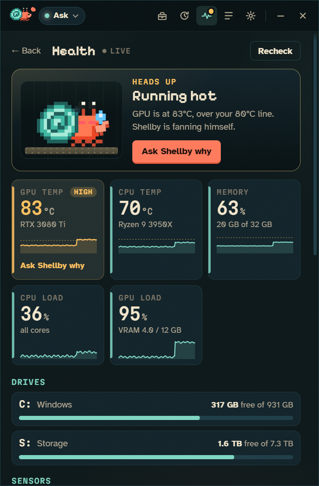</p>

### And keeps you in the loop
- **Asks before acting.** Permission prompts become cards: **Allow**, **Always allow**, or **Deny**, with <kbd>Y</kbd> / <kbd>A</kbd> / <kbd>N</kbd> shortcuts.
- **Flags self-built tooling.** If a command runs a script Claude wrote earlier in the same conversation, or an edit touches Claude Code's own setup (skills, agents, hooks, settings, `CLAUDE.md`), the card says so before you click Allow.
- **Five permission modes.** Ask, Smart (Claude Code's auto mode), Auto-edit, Plan-only, and a fenced-off Autonomous mode.
- **Lives on your desktop, not over your apps.** Shellby sits on the wallpaper layer, behind every window, and stays put through <kbd>Win</kbd>+<kbd>D</kbd>.
- **Also:** drop files on the crab to attach them, a live 5-hour and weekly usage meter, resumable history, a global hotkey, tray, notifications, auto-updates, and [skins](docs/SKINS.md).

<p align="center">
 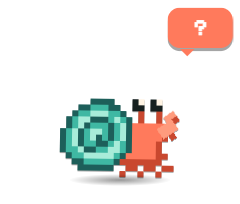 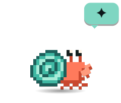  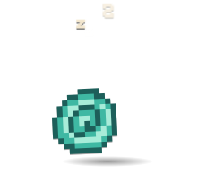
</p>

## Install

1. **Install Claude Code** and sign in with your Claude account (Pro or Max):
   ```powershell
   npm install -g @anthropic-ai/claude-code
   claude auth login
   ```
2. Download **Shellby-Setup-x.y.z.exe** (or the portable build) from [Releases](https://github.com/x-salmon/shellby/releases/latest) and run it.
3. Shellby walks you through a two-step check (CLI found ✓, signed in with a Claude account ✓) and asks how much freedom he gets.

> **Windows SmartScreen:** releases aren't code-signed yet, so Windows may say "Windows protected your PC". Click **More info → Run anyway**, or build from source (below). Every release is built by GitHub Actions from the tagged commit.

**Requirements:** Windows 10 or 11 (x64), Claude Code 2.1+, and a Claude Pro or Max plan.

## How it works

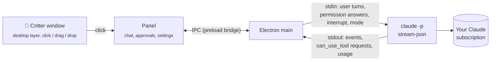

Shellby doesn't talk to any AI API itself. Each conversation is one long-lived Claude Code process:

```
claude -p --input-format stream-json --output-format stream-json --verbose
       --permission-prompt-tool stdio --permission-mode <mode> [--resume <id>]
```

- **Tasks** go in as JSON user messages on stdin. One process holds the whole conversation, so follow-ups keep context.
- **Permission prompts** come out as `control_request { subtype: "can_use_tool" }` and Shellby answers with `allow` / `deny` (plus the suggested rules for "Always allow"). This is the same host protocol the Claude Agent SDK uses.
- **Stop** sends an `interrupt` control request, and falls back to killing the process tree if the CLI doesn't wind down.
- **Mode changes** mid-conversation send `set_permission_mode`.
- **Subagents** come through as `task_started` / `task_progress` / `task_notification` system events. Their messages carry `parent_tool_use_id`, the Agent call that spawned them, and their permission prompts carry `agent_id`, which equals the `task_id`. That's all it takes to route every event, prompt and helper crab to the right lane.
- **The toolbox** merges the skills, agents, commands and MCP servers reported in Claude Code's `init` event with a scan of `~/.claude` and the project's `.claude/`. A file watcher on those folders is how Shellby notices new tricks.
- **Billing safety:** before spawning the CLI, Shellby strips `ANTHROPIC_API_KEY`, `ANTHROPIC_AUTH_TOKEN`, `ANTHROPIC_BASE_URL` and the Bedrock/Vertex/Foundry switches from its environment, and onboarding checks `claude auth status` for a `claude.ai` login. Usage counts against your plan's normal limits, exactly as if you'd typed the task into a terminal.

**Staying on the desktop layer:** the critter window is made an *owned window* of the shell's desktop host (the `Progman`/`WorkerW` window that contains `SHELLDLL_DefView`), via [koffi](https://koffi.dev) FFI calls into `user32.dll`. Owned windows share their owner's z-order band, so he sits above your wallpaper and icons and below every app. A `TaskbarCreated` hook re-pins him when Explorer restarts, and a slow watchdog covers anything else.

## Permission modes

| Mode | Reads | Edits files | Runs commands | Notes |
|---|---|---|---|---|
| **Ask first** *(default)* | ✅ | asks | asks | Recommended. |
| **Smart** | ✅ | auto* | auto* | Claude Code's `auto` mode: a safety classifier approves routine steps and blocks risky ones. |
| **Auto-edit** | ✅ | ✅ | asks | |
| **Plan only** | ✅ | ✗ | ✗ | Shellby proposes a plan card, and nothing changes until you approve. |
| **Autonomous** | ✅ | ✅ | ✅ | `bypassPermissions`. Behind an explicit warning, never the default. |

Your own Claude Code allow/deny rules in `~/.claude/settings.json` still apply in every mode.

## Build from source

```powershell
git clone https://github.com/x-salmon/shellby
cd shellby
npm install
node node_modules/electron/install.js   # only if npm skipped the Electron download
npm start
```

| Script | What it does |
|---|---|
| `npm start` | Run in development |
| `npm test` | Unit and integration tests (Node's built-in runner; a fake Claude CLI stands in for the real one) |
| `node scripts/smoke-real.js` | End-to-end check against your real Claude Code install |
| `node scripts/e2e-ui.js` | Drives the real UI over CDP: two parallel tabs, a subagent needing approval, helper crabs on the desktop |
| `node scripts/overlay-visual-test.js` | Proves the critter never paints over apps: covers it with a window, cycles every mood, and counts real screen pixels |
| `node scripts/e2e-registry.js` | One-click install from the live community registry: warm and cold, themed confirmation, every item previewed |
| `node scripts/e2e-wardrobe.js` | Real task → first trophy unlocks → desktop celebration → wear the Party Hat (isolated profile) |
| `python scripts/preview-wardrobe.py` | Contact sheet of every accessory worn by the crab, for pixel-art work |
| `node scripts/e2e-health.js` | Every health mood with scripted sensors: desktop reaction, speech bubble, Health view, titlebar badge, screenshots |
| `node scripts/ui-regressions.js` | Closing the last tab leaves one tab; themed tooltips replace the OS ones |
| `node scripts/titlebar-fit.js` | Checks the title bar fits at every panel width in every permission mode |
| `node scripts/zorder-probe.js` | Shows where the running critter sits in the window stack and whether it's owned by the desktop |
| `npm run screenshots` | Re-render the README screenshots (with fake account details) |
| `npm run icons` | Regenerate the app icons from the classic skin (needs Python + Pillow) |
| `npm run dist` | Build the NSIS installer and portable exe into `dist/` |

### Project layout

```
src/main/        Electron main process
  main.js          windows, tray, hotkey, IPC, notifications, updates
  sessions.js      parallel conversations (tabs) + the critter's rolled-up mood
  session.js       one Claude Code process per conversation (stream-json + control protocol)
  stream.js        pure parser: CLI events (incl. subagent tasks) → UI items
  safety.js        flags "runs a file Claude wrote" / "changes Claude Code itself"
  toolbox.js       skills/agents/commands/MCP scan + "learned a new trick" watcher
  routines.js      schedule maths + scheduler for recurring tasks
  wardrobe/        catalog (packs + validation), seasons, achievements, and the outfit service
  health/          sensors (nvidia-smi, LibreHardwareMonitor, Windows), pure threshold rules, the monitor loop, alerts
  desktop-layer.js keeps the critter on the wallpaper layer (koffi → user32)
  claude-cli.js    finds the CLI, checks auth, scrubs billing env vars
  history.js       local conversation index + transcripts
  skins.js         loads and validates skins
src/preload/     the only bridge between sandboxed renderers and main
src/renderer/    critter + panel UIs (plain HTML/CSS/JS, no framework)
  panel/           core · feed (crew lanes) · tabs · toolbox · routines · settings · wardrobe · health · boot
src/skins/       built-in skins (JSON pixel grids)
src/wardrobe/    the built-in wardrobe pack (same format as community packs)
test/            node:test suites and a fake Claude CLI
```

## Privacy

Everything stays on your PC. Conversation history lives in `%APPDATA%\Shellby\sessions`, and Shellby has no telemetry and no servers. The only network traffic is Claude Code talking to Anthropic, the updater checking GitHub Releases, community pack downloads you ask for, and Health asking LibreHardwareMonitor for sensor readings on `127.0.0.1`. That last one never leaves your PC. See [SECURITY.md](SECURITY.md) for the renderer sandboxing details.

## Contributing

Skins, bug reports and PRs are welcome. See [CONTRIBUTING.md](CONTRIBUTING.md).

## Disclaimer

Shellby is an independent open-source project. It is **not affiliated with, endorsed by, or sponsored by Anthropic**. "Claude" and "Claude Code" are trademarks of Anthropic, PBC. Shellby only automates the official Claude Code CLI you install and sign in to yourself, and your use of it is subject to [Anthropic's terms](https://www.anthropic.com/legal/consumer-terms).

Shellby acts on your real files with your real permissions. Read what you approve, and keep backups.

<sub>MIT licensed. Fonts: Pixelify Sans, Atkinson Hyperlegible and Martian Mono (SIL OFL 1.1).</sub>
